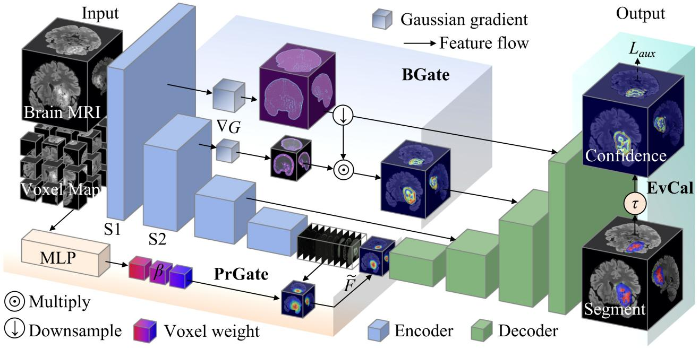

<p align="center">
  
</p>

<h1 align="center">KnowNet: Boundary Gating and Pathology-Aware Aggregation for Calibrated Brain Tumor Segmentation</h1>

<p align="center">
  <a href="https://www.python.org/downloads/release/python-390/"></a>
  <a href="https://pytorch.org/"></a>
  <a href="https://opensource.org/licenses/MIT"></a>
  <a href="https://monai.io/"></a>
</p>

<p align="center">
  <b>Knowledge-driven 3D brain tumor segmentation framework with boundary gating, pathology-aware multi-scale aggregation, and calibrated evidential uncertainty.</b><br>
  Achieves <b>93.43% Mean Dice</b> and <b>5.28 mm HD95</b> on BraTS 2021,<br>
  outperforming SOTA methods by <b>+2.94% Mean Dice</b> with only <b>1.3% parameter increase</b> over baseline.
</p>

---

## Overview

Glioma segmentation in 3D MRI faces three fundamental challenges: (1) inadequate boundary representation at the enhancing tumor (ET) rim and peritumoral edema (ED) infiltrative front, (2) lack of pathology-prior guidance in multi-scale context fusion, and (3) absence of calibrated voxel-wise confidence for clinical decision-making. We propose **KnowNet**, a knowledge-driven framework built on a SegResNet backbone with three pluggable knowledge modules:

| Module | Code Name | Role |
|--------|-----------|------|
| **BGate** | `BoundGATE` | Multi-scale Gaussian gradient → Sigmoid gating: enhances boundary features at ET/ED interfaces |
| **PrGate** | `PyraGATE` | Voxel-coordinate MLP → softmax-gated tri-dilation (d=1,2,3) DWConv3d: pathology-prior scale selection |
| **EvCal** | `EKD_CALIB` | Learnable temperature τ calibrated evidential uncertainty: inverse-U guided training |

Experimental evaluations on three BraTS benchmarks demonstrate:
- **93.43%** Mean Dice on BraTS 2021, **92.70%** on BraTS 2020, **91.97%** on BraTS 2023
- **5.28 mm** Mean HD95 on BraTS 2021, outperforming all SOTA methods at p&lt;0.01 (Bonferroni corrected)
- **+2.94%** average Dice improvement over the best competing method (Swin UNETR)
- Only **+1.3%** parameter increase over SegResNet baseline (30.4M total)

---

## Installation

```bash
git clone https://github.com/CV-Med/KnowNet.git
cd KnowNet

# Git LFS required for sample data
git lfs install
git lfs pull

# Install dependencies
pip install -r requirements.txt
```

**Requirements:** Python 3.9+, PyTorch 2.0+, CUDA-capable GPU with 16GB+ memory (recommended)

Key dependencies:

| Package | Version | Purpose |
|---------|---------|---------|
| `torch` | ≥ 2.0.0 | Deep learning framework |
| `torchvision` | ≥ 0.15.0 | Supplementary utilities |
| `monai` | ≥ 1.2.0 | Medical image operations |
| `nibabel` | ≥ 5.0.0 | NIfTI I/O |
| `numpy` | ≥ 1.22.0 | Numerical operations |
| `scipy` | ≥ 1.8.0 | Distance transforms & interpolation |
| `pyyaml` | ≥ 6.0 | Config file parsing |
| `tqdm` | ≥ 4.64.0 | Training progress bars |
| `matplotlib` | ≥ 3.6.0 | Visualization |

---

## Dataset Preparation

### Supported Datasets

BraTS 2021, 2020, and 2023 — each sample contains four MRI modalities (T1, T1ce, T2, FLAIR) with voxel-level annotations for three sub-regions: necrotic core (NEC), peritumoral edema (ED), and enhancing tumor (ET).

| Dataset | Samples (train/val) | Modalities | Source |
|---------|-------------------|------------|--------|
| **BraTS 2021** | 1,000 / 251 | T1, T1ce, T2, FLAIR | [Synapse](https://www.synapse.org/Synapse:syn27097444) |
| **BraTS 2020** | 295 / 74 | T1, T1ce, T2, FLAIR | [MICCAI BraTS](https://www.med.upenn.edu/brats2020/) |
| **BraTS 2023** | 703 / 176 | T1, T1ce, T2, FLAIR | [BraTS 2023](https://www.synapse.org/Synapse:syn51364943) |

### Data Structure

```
data/BraTS2021/
├── BraTS2021_00000/
│   ├── BraTS2021_00000_flair.nii.gz
│   ├── BraTS2021_00000_t1.nii.gz
│   ├── BraTS2021_00000_t1ce.nii.gz
│   ├── BraTS2021_00000_t2.nii.gz
│   └── BraTS2021_00000_seg.nii.gz
├── BraTS2021_00001/
└── ...
```

Label 4 (enhancing tumor) is remapped to 3 internally. Evaluation uses three clinical regions: **WT** (Whole Tumor = 1+2+3), **TC** (Tumor Core = 1+3), **ET** (Enhancing Tumor = 3).

---

## Usage

### Full Training

```bash
python run.py --mode train --config configs/config.yaml
```

| Argument | Default | Description |
|----------|---------|-------------|
| `--mode` | `train` | `train`, `test`, `eval`, or `ablation` |
| `--config` | `configs/config.yaml` | Path to YAML configuration |
| `--round` | `None` | Override iteration round from config |
| `--num_seeds` | `None` | Number of seeds for multi-seed ablation |

**Training configuration (configs/config.yaml):**
- **Epochs:** 200 | **Batch size:** 2 | **Optimizer:** AdamW (lr=5e-4, wd=1e-4)
- **Scheduler:** Poly LR (power=0.9) + 5-epoch linear warmup
- **Gradient accumulation:** 4 steps; dual gradient clipping (clip=0.5)
- **Loss:** Deep supervision Dice (main=1.0, aux=[0.4, 0.3, 0.2, 0.1])
- **Normalization:** GroupNorm | **Activation:** LeakyReLU(0.01)
- **Early stop:** Patience 30 epochs, validation every 10
- **Checkpoint:** Auto-loads `weights/best_checkpoint.pth`; saves best + latest

### Evaluation

```bash
# Evaluate best checkpoint on validation split
python run.py --mode test --config configs/config.yaml
```

Outputs Dice, IoU, and HD95 for WT, TC, and ET regions.

### Ablation Study

```bash
# Systematic module ablation (30-epoch finetune per module)
python run.py --mode ablation --config configs/config.yaml

# Multi-seed for statistical significance
python run.py --mode ablation --config configs/config.yaml --num_seeds 5
```

Disables each module (`BoundGATE`, `PyraGATE`, `EKD_CALIB`) one-by-one, finetunes, and records ΔDice + Cohen's d to `experiment_summary.json`.

### Batch Inference & Visualization

```bash
python predict/predict.py
```

Processes sample cases from `predict/BraTS2021_*/` and generates PNG overlay comparisons (prediction + ground truth overlay on Flair) in `predict/results/`.

---

## Results

**Summary:** KnowNet achieves **93.43% Mean Dice** and **5.28 mm Mean HD95** on BraTS 2021, outperforming all SOTA methods by a significant margin (p&lt;0.01, Bonferroni corrected, Cliff's Δ ≥ 0.60). Consistent gains are observed across BraTS 2020 and BraTS 2023.

### Table 1: Dice Similarity Coefficient (%) — KnowNet vs SOTA on BraTS Datasets

| Method | BraTS 2021 | | | | BraTS 2020 | | | | BraTS 2023 | | | |
|--------|:---:|:---:|:---:|:---:|:---:|:---:|:---:|:---:|:---:|:---:|:---:|:---:|
| | **WT** | **TC** | **ET** | **Mean** | **WT** | **TC** | **ET** | **Mean** | **WT** | **TC** | **ET** | **Mean** |
| MBANet [33] | 92.18 | 88.33 | 85.47 | 88.66 | 91.66 | 87.61 | 84.59 | 87.95 | 91.24 | 86.78 | 83.83 | 87.28 |
| 3DUV-NetR+ [3] | 91.94 | 88.02 | 85.26 | 88.41 | 91.45 | 87.39 | 84.44 | 87.76 | 91.03 | 86.47 | 83.62 | 87.04 |
| VcaNet [51] | 92.36 | 88.61 | 85.75 | 88.91 | 91.84 | 87.98 | 84.93 | 88.25 | 91.42 | 87.06 | 84.11 | 87.53 |
| SegResNet [58] | 92.75 | 89.19 | 86.04 | 89.33 | 92.23 | 88.47 | 85.22 | 88.64 | 91.81 | 87.55 | 84.46 | 87.94 |
| nnU-Net [53] | 92.54 | 89.58 | 87.33 | 89.82 | 92.02 | 88.86 | 86.51 | 89.13 | 91.69 | 87.88 | 85.78 | 88.45 |
| Swin UNETR [54] | 92.83 | 90.27 | 88.38 | 90.49 | 92.39 | 89.45 | 87.29 | 89.71 | 92.08 | 88.53 | 86.52 | 89.04 |
| **KnowNet** | **95.72** | **93.26** | **91.31** | **93.43** | **95.36** | **92.56** | **90.18** | **92.70** | **94.88** | **91.96** | **89.08** | **91.97** |

All results reported as mean over 5 independent runs. All comparisons statistically significant (paired Wilcoxon, Bonferroni correction m=6, p&lt;0.01). **Bold** = best result.

### Table 2: Hausdorff Distance (mm, 95th percentile) — KnowNet vs SOTA on BraTS Datasets

| Method | BraTS 2021 | | | | BraTS 2020 | | | | BraTS 2023 | | | |
|--------|:---:|:---:|:---:|:---:|:---:|:---:|:---:|:---:|:---:|:---:|:---:|:---:|
| | **WT** | **TC** | **ET** | **Mean** | **WT** | **TC** | **ET** | **Mean** | **WT** | **TC** | **ET** | **Mean** |
| MBANet [33] | 4.30 | 6.70 | 8.98 | 6.66 | 4.57 | 7.11 | 9.55 | 7.08 | 4.83 | 7.52 | 10.11 | 7.49 |
| 3DUV-NetR+ [3] | 4.35 | 6.74 | 9.10 | 6.73 | 4.62 | 7.16 | 9.65 | 7.14 | 4.87 | 7.56 | 10.20 | 7.54 |
| VcaNet [51] | 4.18 | 6.55 | 8.85 | 6.53 | 4.44 | 6.96 | 9.41 | 6.94 | 4.71 | 7.37 | 9.96 | 7.35 |
| SegResNet [58] | 4.12 | 6.52 | 8.75 | 6.46 | 4.39 | 6.95 | 9.32 | 6.89 | 4.66 | 7.39 | 9.90 | 7.32 |
| nnU-Net [53] | 3.98 | 6.31 | 8.42 | 6.24 | 4.25 | 6.75 | 9.00 | 6.67 | 4.53 | 7.15 | 9.58 | 7.09 |
| Swin UNETR [54] | 3.85 | 6.05 | 8.18 | 6.03 | 4.20 | 6.56 | 8.87 | 6.54 | 4.46 | 7.00 | 9.47 | 6.98 |
| **KnowNet** | **3.38** | **5.28** | **7.18** | **5.28** | **3.66** | **5.72** | **7.78** | **5.72** | **3.92** | **6.12** | **8.32** | **6.12** |

Lower is better. KnowNet achieves the lowest HD95 across all regions and datasets, with the largest improvement in the ET region (boundary-critical area).

### Table 3: Ablation Study on BraTS 2021

| No. | BGate | PrGate | EvCal | Mean Dice | Dice WT | Dice TC | Dice ET |
|:---:|:---:|:---:|:---:|:---:|:---:|:---:|:---:|
| 1 | | | | 89.27 | 92.69 | 89.15 | 86.09 |
| 2 | ✓ | | | 90.15 | 93.08 | 89.92 | 87.46 |
| 3 | | ✓ | | 90.76 | 93.34 | 90.52 | 88.42 |
| 4 | | | ✓ | 90.39 | 93.04 | 90.12 | 88.02 |
| 5 | ✓ | ✓ | | 91.66 | 93.56 | 91.22 | 90.25 |
| 6 | ✓ | | ✓ | 91.71 | 93.65 | 91.26 | 90.24 |
| 7 | | ✓ | ✓ | 91.94 | 93.74 | 91.42 | 90.73 |
| 8 | ✓ | ✓ | ✓ | **93.43** | **95.72** | **93.26** | **91.31** |

All three modules contribute positively. PrGate provides the largest single-module gain (+1.49%). The full model achieves +4.16% over baseline.

### Table 4: Model Efficiency

| Method | Params (M) | Inference (ms) | GFLOPs |
|--------|:----------:|:--------------:|:------:|
| MBANet [33] | 28.5 | 330 | 318.6 |
| 3DUV-NetR+ [3] | 33.2 | 420 | 385.3 |
| VcaNet [51] | 35.1 | 400 | 362.8 |
| SegResNet | 30.0 | 310 | 326.2 |
| nnU-Net [53] | 31.2 | 350 | 340.5 |
| Swin UNETR [54] | 62.1 | 520 | 485.7 |
| **KnowNet** | **30.4** | **380** | **337.8** |

KnowNet adds only +0.4M parameters (+1.3%) over SegResNet while achieving substantial performance gains, confirming that improvements come from knowledge injection rather than parameter scaling.

---

## Hyperparameters

Experimental environment and hyperparameter settings:

| System Component | Specification |
|-----------------|---------------|
| GPU | NVIDIA RTX 4090 × 1 |
| OS | Ubuntu 20.04 LTS |
| CUDA | 11.8 |
| Framework | PyTorch 2.0 |
| Input size | 128 × 128 × 128 |

| Training Parameter | Value |
|--------------------|-------|
| Optimizer | AdamW |
| Learning rate | 5 × 10⁻⁴ |
| Weight decay | 1 × 10⁻⁴ |
| Batch size | 2 |
| Epochs | 200 |
| Scheduler | Poly (power=0.9) |
| Warmup epochs | 5 |
| Gradient accumulation | 4 steps |
| Gradient clip | 0.5 |
| Early stop patience | 30 |

| Module | Parameter | Value |
|--------|-----------|-------|
| BGate | Gradient sigma | [1.0, 2.0] |
| PrGate | Dilation rates | [1, 2, 3] |
| PrGate | MLP hidden dim | 16 |
| PrGate | Coord normalization | [0, 1] |
| EvCal | Temperature τ | Learnable (initial 1.0, converged ~0.82) |
| EvCal | τ range clamp | [0.01, 10.0] |

---

## Ablation Guide

Disable modules individually at build time:

```python
# Disable single module
model = build_model(config, disabled_modules=["BoundGATE"])

# Disable multiple modules
model = build_model(config, disabled_modules=["BoundGATE", "EKD_CALIB"])
```

Or via CLI ablation mode (automates per-module disable + finetune):

```bash
# Full ablation
python run.py --mode ablation --config configs/config.yaml

# Ablation with 5 random seeds for statistical rigor
python run.py --mode ablation --config configs/config.yaml --num_seeds 5
```

### Evaluation Metrics

Three metrics are used for evaluation (results reported as mean ± std over 5 independent runs):

- **Dice Similarity Coefficient (DSC):** $DSC = \frac{2|P \cap T|}{|P| + |T|}$
- **Hausdorff Distance (HD95):** 95th percentile of boundary distances
- **Boundary regions:** WT (1+2+3), TC (1+3), ET (3)

---

## Project Structure

```
KnowNet/
├── run.py                   # Entry point: train / test / eval / ablation modes
├── requirements.txt         # Python dependencies
├── .gitignore               # Git ignore rules
├── .gitattributes           # Git LFS tracking for .nii.gz
├── LICENSE                  # CC BY-NC 4.0
├── AGENTS.md                # Agent instructions for OpenCode
├── configs/
│   └── config.yaml          # All hyperparameters (model, training, loss, ablation)
├── data/
│   ├── dataset.py           # BraTSDataset — NIfTI loading, train/val split, label remap
│   ├── transforms.py        # Augmentation pipeline (scale, gamma, noise, contrast, flip, z-score)
│   └── fig1.png             # Architecture diagram
├── models/
│   ├── __init__.py          # BrainTumorSegModel — backbone + 3 modules; build_model()
│   ├── backbone.py          # Encoder (5-stage ResBlock3D), Decoder (deep supervision)
│   └── innovation_module.py # BoundGATE, PyraGATE, EKDCalib
├── engines/
│   ├── trainer.py           # Training loop, poly/cosine scheduler, dual gradient clipping
│   └── evaluator.py         # Evaluation: Dice, IoU, HD95
├── losses/
│   ├── __init__.py
│   └── loss.py              # DiceLoss, DeepSupervisionLoss (with uncertainty weighting)
├── utils/
│   ├── reproducibility.py   # Seed setting, deterministic mode
│   ├── metrics.py           # DiceScore, IoUScore, HD95Score, region_dice
│   ├── logger.py            # Logging to file + stdout
│   └── experiment_recorder.py # Ablation tracking, Cohen's d, SOTA comparison
├── predict/
│   ├── predict.py           # Batch inference + PNG visualization
│   ├── BraTS2021_*/         # Sample test cases (Git LFS)
│   └── results/             # Generated overlay PNGs (auto-created)
└── weights/                 # Model checkpoints (auto-created, gitignored)
```

### File Descriptions

| File | Responsibility | Key Functions / Classes |
|------|---------------|------------------------|
| `run.py` | CLI entry point | `main()` — argument parsing, mode dispatch |
| `models/__init__.py` | Model assembly | `BrainTumorSegModel`, `build_model()` |
| `models/backbone.py` | SegResNet core | `Encoder`, `Decoder`, `DecoderBlock`, `ResBlock3D` |
| `models/innovation_module.py` | Knowledge modules | `BoundGATE` (Eq.1), `PyraGATE` (Eq.2), `EKDCalib` (Eq.3) |
| `engines/trainer.py` | Training engine | `WarmupPoly`, `WarmupCosine`, `Trainer` with deep supervision |
| `engines/evaluator.py` | Evaluation | `Evaluator` — Dice + IoU + HD95 + uncertainty prediction |
| `losses/loss.py` | Loss functions | `DiceLoss`, `DeepSupervisionLoss` with inverse-U weighting |
| `predict/predict.py` | Inference & viz | `predict_volume()`, `visualize_sample()`, `compute_region_dice()` |
| `utils/experiment_recorder.py` | Experiment tracking | `ExperimentRecorder` — ablation, Cohen's d, SOTA comparison |

---

## Citation

If you use this code or find our work useful, please cite:

```bibtex
@article{KnowNet2025,
  title={KnowNet: Boundary Gating and Pathology-Aware Aggregation for Calibrated Brain Tumor Segmentation},
  author={},
  journal={Knowledge-Based Systems},
  year={2025}
}
```

---

## License

This project is licensed under **Creative Commons Attribution-NonCommercial 4.0 International (CC BY-NC 4.0)**.
